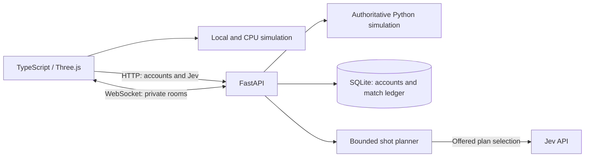

# Pool Simulator

[Play in your browser](https://pool.martinospizza.dev) · [Controls](docs/camera-controls.md) · [Jev planner](docs/jev.md)

Browser-based 8-ball with a Three.js table, mouse/trackpad and touch controls,
local two-player games, an offline CPU, private online rooms and Jev AI opponents.
A guided practice tutorial teaches the selected input mode. Accounts provide
persistent casual match statistics; private online games also support guests.

## Architecture



The browser predicts player shots immediately. In online and Jev games, only the
server resolves turns, fouls and results. Both simulators use shared fixtures in `contracts/`; these check agreement for
the covered cases, not every possible trajectory. See [simulation synchronization](docs/simulation-sync.md)
for snapshot precision and replay checks. Ball flight, spin, cushions and pockets are approximations rather than
a calibrated professional billiards model. See [planner evaluation and limitations](docs/planner-research.md).

- `frontend/src/`: rendering, input, local simulation and interface.
- `backend/app/`: FastAPI routes, authoritative simulation, rooms and persistence.
- `contracts/`: shared fixtures and the bundled agreement-content hash.
- `.github/workflows/`: required CI, advisory browser tests and main-branch deployment.

## Local development

Use Python 3.13, uv, and Node.js 22. Install the committed dependencies:

```sh
uv sync --project backend --frozen
npm --prefix frontend ci
```

Run these in separate terminals:

```sh
uv run --project backend uvicorn app.main:app --app-dir backend --reload --port 8000
npm --prefix frontend run dev
```

Vite proxies `/api` and `/ws` to port 8000. Jev requires a backend `JEV_API_KEY`;
local and CPU games do not. Never put provider credentials in frontend variables.
For a single-container build, run `docker build -t pool-sim .` and use the Compose
configuration with a persistent database volume.

## Verification and releases

See the [1.0.0 reliability review](docs/reliability-review.md) for findings, fixes and
remaining implementation boundaries.

```sh
uv run --project backend --no-sync pytest backend/tests -q
uvx ruff check backend/
uvx ruff format --check backend/
npm --prefix frontend test
npm --prefix frontend run build
cd frontend
npx playwright install chromium
npm run test:e2e
npm run test:passkeys
npm run test:online
```

The build includes TypeScript checking; `npm run typecheck` runs it separately.
The online browser suite uses a temporary SQLite database, never production data.
Required `ci` aggregates Ruff, backend tests, frontend tests/build and the container
build. Browser checks run separately on development branches: four standalone
shards plus independent passkey and online integration jobs, each with one worker.
The `browser-report` artifact contains the combined HTML report; per-job artifacts
retain failure screenshots and traces. See the [Playwright sharding guide](https://playwright.dev/docs/test-sharding). Only pushes to
`main` publish an image and deploy through CI/CD. A failed deployment health check
fails the workflow. Live rooms are in memory: run **one API worker / instance**.

## Changelog maintenance

Always update the root `changelog.json` as you make user-visible changes. The
version button displays this committed file in the in-game changelog modal. Keep
releases newest first, with `version`, ISO `date`, `title`, and a `changes` list
of plain-language entries. Add changes to the current release while iterating;
create a new entry when bumping the version. Keep its version aligned with
`info.yml`, `backend/pyproject.toml`, and `backend/uv.lock`. Build the frontend
after editing the changelog to validate its import.

## Online play and optional accounts (0.5.0)

Open **Online → Create room**, then copy the invite link. The link carries an
8-character room code in its fragment (`/#join=CODE`), so the code is not part of
normal HTTP request/referrer logs. Opening it pre-fills the join form; guests need
no account. Both players must join before shooting. Rooms close when a player
leaves, refreshes, loses the connection, or is idle for 15 minutes. Completed
matches stay recorded; after the first accepted shot, disconnects count as casual
forfeits unless caused by server shutdown.

Accounts are optional and usernames are 3–20 ASCII letters, digits, or underscores,
unique without regard to case. Passwords are 15–128 characters. Passwords and
recovery codes are salted Argon2id hashes (19 MiB, two passes, one lane), never
reversibly encrypted. The 160-bit recovery code is shown once; successful recovery
rotates it, invalidates all sessions, and removes saved passkeys and Google links. Accounts support
password, optional passkey, and optional Google sign-in; Google signup does not set a password. There is no administrative bypass or email recovery. Opaque session cookies
are HttpOnly, SameSite=Lax, expire after 30 days, and are Secure in production.
Only token hashes are stored in the database; credentials are not kept in browser
storage. Auth mutations require a same-origin request and a custom request header.
Account/IP attempt limits persist across server restarts.

Account stats count authoritative private online and Jev matches, with a breakdown by mode. Local/CPU games and client-submitted results do not contribute. The ledger stores stable account IDs, guest/name
snapshots, opponents, rules/version, timestamps, outcomes, disconnects, and shot
facts. This is the foundation for future lobbies/matchmaking; private games are
currently unrated and there is no public matchmaking queue yet.

### Persistence and deployment

Both Compose files retain the existing named `pool_data` volume at `/srv/data`,
with `DATABASE_URL=sqlite:////srv/data/pool.db`. Rebuilding/replacing the container
preserves accounts, session verifiers, match history, and stats. Initial startup
creates the current tables idempotently. The premium upgrade explicitly adds
`accounts.premium` (default false) and makes `jev_games.day` nullable using an
Alembic batch migration, preserving game data, indexes and free-game uniqueness.
NULL allowance days identify premium games; `started_at` retains creation time.
Changes to existing columns need explicit migrations. Obsolete test tables in
an existing database are no longer mapped or exposed by the application.

Production publishes port 8000 on host loopback for the existing HTTPS reverse
proxy, and trusts that proxy’s forwarded client IP so rate limits apply per client.
Do not expose the API port publicly while trusting forwarded headers.
Production Compose sets `COOKIE_SECURE=true` and allows origin
`https://pool.martinospizza.dev`. Set `ALLOWED_ORIGINS` (comma-separated) when using
additional trusted frontend origins. Local HTTP development keeps Secure cookies
off by default. No Fernet key or application encryption key is required. Protect
the database and its backups as account data.

Run **one Uvicorn worker / one API instance** while live rooms are held in memory.
SQLite uses WAL, foreign keys, and a busy timeout. The production entrypoint (`python -m app.server`) marks shutdown before closing
live sockets; restarting marks persisted active matches interrupted without inventing
wins/losses. Leaving or losing connection after the first accepted shot is a casual
forfeit; leaving before play starts is an abandonment without a winner. PostgreSQL can replace the SQLAlchemy database URL later, but horizontal
scaling also needs shared room coordination and distributed rate limiting.

For a consistent live backup (including the WAL), use the backup API rather than
copying `pool.db` while it is open:

```sh
docker compose exec -T api uv run --directory backend python scripts/backup_db.py /srv/data/backups/pool-2026-10-08.db
docker cp pool-simulator-api:/srv/data/backups/pool-2026-10-08.db ./pool-2026-10-08.db
```

Use a fresh output filename for each backup and keep a copy outside the Docker
volume. For a restore, stop the API, restore the database into the same volume,
remove stale WAL/SHM files from the stopped database, then restart. Do not run
`docker compose down -v` unless intentionally deleting all persistent data.

### Integration checks

```sh
uv sync --project backend --frozen
npm --prefix frontend run build
cd frontend
npm run test:online
```

The online suite starts a real backend on port 8011 with a temporary SQLite database
and exercises account creation, recovery, persistent sessions, a registered host,
a guest invite, authoritative shot results, and stats. It never uses the development
or production account database. Ordinary UI tests stay backend-independent.

Security references: [OWASP password storage](https://cheatsheetseries.owasp.org/cheatsheets/Password_Storage_Cheat_Sheet.html),
[session management](https://cheatsheetseries.owasp.org/cheatsheets/Session_Management_Cheat_Sheet.html), and
[account recovery](https://cheatsheetseries.owasp.org/cheatsheets/Forgot_Password_Cheat_Sheet.html).

### Mobile and trackpad controls (0.6.0)

On a touchscreen, drag one finger on the felt to aim continuously. Lift without
shooting, set the power slider, then tap **Shoot**. Two fingers moving together
orbit the table; spreading/pinching the same fingers zooms without needing to
restart the gesture. Lift both fingers before aiming again. **View → Move camera**
retains one-finger orbit and two-finger pan/zoom. Three-finger gestures are not
required because they can conflict with operating-system accessibility controls.

Mobile player names, groups, and remaining counts stay visible. **Show balls**
expands the numbered ball details; **More** reveals CPU and new-rack controls. Spin and Reset remain visible for every shot.
Mouse play uses hover-to-aim and pull/release. Select Trackpad Mode in the HUD
for two-finger orbit, pinch zoom and Option/Alt-scroll pan. WASD moves horizontally,
Space rises, Left Shift descends and Q/E turns. With the table focused, Enter
fires a 40% power shot. Camera mode also offers left-button dragging.

The gesture implementation uses [Pointer Events](https://www.w3.org/TR/pointerevents3/)
and [Three.js OrbitControls](https://threejs.org/docs/pages/OrbitControls.html).
Browser tests exercise real multi-touch pinch-to-orbit and partial finger release;
physical Android/iOS hardware remains useful for evaluating feel and OS gestures.

Dependabot checks weekly for npm, uv, Docker, and GitHub Actions updates. Runtime
and development dependencies are grouped separately for npm and uv; container
images and Actions each have their own group. Version-update PRs target `develop`
so they go through tests before the release PR to `main`. Configuration follows
[GitHub's grouping reference](https://docs.github.com/en/code-security/reference/supply-chain-security/dependabot-options-reference).


### Online security (0.6.1)

The server simulates shots, checks turns and placements, and records results.
Browser state and playback acknowledgements are not trusted. The legacy `/api/scores` and `/api/replays` routes, database models, and unused
REST replay transport have been removed entirely.
Account totals are unranked casual statistics, including private/custom games and
forfeits. They are not a matchmaking rating: cooperating players and aiming bots
can still produce valid shots. Future ranked games need a separate eligibility and
abuse policy; never reuse these casual totals as ranked results.

Connections are capped at eight per IP and 400 total, with 200 rooms and four
concurrent simulations. Each socket has a 30-message burst, replenishing at one
message per second. Before joining a room, sockets time out after 30 seconds;
room sockets time out after 15 minutes without a message. HTTP bodies and production
WebSocket messages are limited to 16 KiB. The single-worker production entrypoint
also limits WebSocket queues and marks planned shutdowns before disconnecting
players. Use `python -m app.server` for production, as the Dockerfile does.

HTTPS pages use same-origin HTTPS and WSS with normal browser certificate validation.
Browsers no longer support site-controlled HPKP certificate pinning; we do not
attempt JavaScript pinning. HTTPS responses send HSTS (one year, this host only),
plus CSP, anti-framing, no-referrer, and MIME-sniffing protection. TLS terminates at
the host proxy, with the backend port published only on loopback. Keep the proxy's
HTTP-to-HTTPS redirect and certificate renewal working. Do not expose the backend
port publicly or widen forwarded-header trust.

References: [OWASP WebSocket security](https://cheatsheetseries.owasp.org/cheatsheets/WebSocket_Security_Cheat_Sheet.html),
[Chrome HPKP removal](https://developer.chrome.com/blog/chrome-72-deps-rems/),
and [HSTS](https://developer.mozilla.org/en-US/docs/Web/HTTP/Reference/Headers/Strict-Transport-Security).

## Jev AI, privacy, and monthly budgets

CPU stays offline and account-free. Jev AI requires a signed-in adult account and
explicit acceptance of the current Terms. Free accounts receive a $0.15 monthly
allowance by default, configurable globally or per account in Admin. Dollar top-ups
apply to the current UTC calendar month only. Premium remains unlimited. The daily
game-count cap is removed; starting a rack costs nothing by itself. An admitted
rack can use $0.02 completion grace, then the CPU planner finishes without further
provider calls. Resuming remains free and does not discard the existing rack.
Account ownership, Terms acceptance and concurrent-shot protections still apply.

After deploying, toggle an existing account on this host (case-insensitive):

```sh
cd ~/pool-simulator
docker compose exec -T api uv run --directory backend python -m app.premium USERNAME on
docker compose exec -T api uv run --directory backend python -m app.premium USERNAME off
```

To enable all accounts that currently exist, use the same command with `--all-existing on` in place of `USERNAME on`. New registrations still default to free.

The boolean defaults off. Only the configured owner can toggle it through the admin API. Existing sessions
see changes on their next account refresh or Jev request. Revocation applies the free allowance to future starts without resetting consumed slots.
Back up the existing database before upgrading; preserve the `pool_data` volume.

Jev 1.13 chooses among up to 12 server-planned shots with semantic descriptions
of settled physics previews. A bounded planner proposes direct pots, banks,
kicks, combinations and safeties, including cue placement when needed. One model
request selects a tactical family and its corresponding offered plan. The server
owns placement, aim, power, spin and all outcomes. Single-plan turns need no model
call; provider failures use a visible local
fallback. Reported usage is metered even when an answer is invalid.

The offline CPU also previews a bounded set of legal-target shots and plans
placement together with the shot. Kitchen escapes can leave the head string
before returning to a target inside it. Deterministic regression fixtures improve
legality and pots over the old geometry policy; this does not establish Jev's
competitive win rate. See [planner research and benchmark](docs/planner-research.md)
and [Jev decision design](docs/jev.md) for sources and limits.
Completed Jev games count toward account win/loss statistics. Results survive detailed-game retention. Retained historical completed games are backfilled; unavailable historical shot metrics are labeled incomplete rather than fabricated.

Set `JEV_API_KEY` only in the backend process environment or deployment folder's
ignored `.env` (mode `0600`). Both Compose configurations pass it to the API. Never
use a `VITE_` key or commit a credential. Missing configuration leaves other modes
working. The production pool nginx proxy must **replace** `X-Forwarded-For` with
`$remote_addr`, not append arbitrary client headers; only the loopback-published
backend should be reachable. This is required for trustworthy account security throttles.

`jev_games` stores private game state, revisions, request counts, provider input
and output tokens, estimated cost in nano-USD, and unmetered failures. The pinned
model price is recorded per game (42 nano-USD per input token as researched); this
is an estimate, not an invoice. Failed or incomplete provider responses can leave
actual charges unknown, explicitly counted as unmetered. These records have no
public reporting endpoint. Account/game ownership checks protect resume endpoints.
`jev_usage` retains lifetime attempt/completion counters. `jev_requests` records
one attempt before each provider call, linked to the account, rack, turn and seat.
Reported input tokens are charged at the stored 42 nano-USD/token rate; outputs
are free. Integer nanodollars prevent cent-rounding losses. Missing usage is
unknown, never zero: a separate reservation uses the published 64K-token maximum.
Reservations and admission serialize on the account row. Each retry is a separate
attempt; settlement is idempotent. CPU vs CPU has no provider calls, Jev vs CPU
meters the Jev seat, and Jev vs Jev meters each actual request without a multiplier.
Monthly attribution uses the request start timestamp in UTC. Old game estimates
remain available but are not fabricated into request-level records or charged to
the new allowance. The ledger starts with 1.1.0. Request and adjustment records
expire after 90 days; current-month accounting is preserved.

Admin shows current budget, spend, unknown reservations, recent request records,
and audited monthly adjustments. Top-up request IDs prevent duplicate credits on
network retries. Calculated usage charges are not provider-issued receipts.
TypeSafe's documented API/SDK do not expose prepaid balance: Admin explicitly
shows it as unavailable and links to the provider billing page. Funding remains
manual, outside this application's per-player allowance system.
Network-wide and global usage caps and Jev start/turn throttles remain removed.
Concurrent Jev turns remain bounded at four to protect simulation capacity.


Terms and Privacy are served at `/terms.html` and `/privacy.html`, with operator
Noah Martino, Pennsylvania, and personal.boredhero@gmail.com. Registration requires
an 18+ affirmation and records Terms version/time; existing users accept updated
Terms in Account before Jev use. Acceptance is stored against a SHA-256 hash of
the visible agreement text; unchanged text does not prompt again. When editing
`frontend/public/terms.html`, update `contracts/terms.json` to the canonical hash
from `app.services.terms.terms_version()`; backend tests enforce that contract. These documents need qualified legal review for
the operator's actual audience and practices; they do not certify legal compliance.

Optional first-party feature analytics is off until separate adult opt-in. Privacy
choices offers withdrawal and honors GPC/DNT. `visitor_sessions` and `feature_events`
store random session identifiers, broad input type, times and fixed feature names;
no account link, IP, URL, raw user agent, text input, or session replay. Only the owner can read aggregate visit counts in the admin overview. Consent uses an
HttpOnly one-day random cookie, reused until expiry. Visits are deduplicated within
30 minutes of activity. Daily visitor IDs are not unique people and include consenting
signed-in browsers without account links. The updated notice requires renewed opt-in; withdrawal
removes that session and its events. Older unlinked sessions expire through retention.
Essential sign-in, security limits and Jev billing/allowance records are independent
of analytics consent. Terms acceptance never implies analytics consent.

Startup/hourly maintenance removes analytics sessions inactive for 30 days, detailed Jev games
inactive for 90 days, requests 90 days after their start, and budget adjustments 90 days after
their timestamp. Shared match/shot history and account-lifecycle audit records have no automatic
expiry. Deletion clears shared match account links and replaces names with Deleted player;
lifecycle audits retain opaque actor/target IDs, actions and timestamps. Authentication expiry
and physical cleanup are separate: expired records are purged during later auth operations. Preserve the existing `pool_data` volume. New tables are
additive. Account access/export/deletion requests go to the public contact address;
verify ownership without asking for a password or recovery code. Production host
logs and backup rotation must be managed separately from application retention.
See [Jev integration notes](docs/jev.md) for research and evaluation limitations.

The Help panel includes an optional interactive tutorial using an isolated practice
rack and staged camera views. Exiting restores the prior local game. Instructions
follow touch, mouse or trackpad input, including the normal desktop pull-and-release
power bar. Compact panels leave the active controls usable on mobile.
On compact screens, tap either scorecard (or use Enter/Space when focused) to show
or hide ball details; there is no floating Show balls button.

## Owner dashboard (0.8.0)

Set `ADMIN_ACCOUNT_ID` in the deployment environment to the existing owner's
immutable account ID. An unset value disables administration. Usernames do not
grant privileges, and registration cannot assign admin status. The owner sees
**Admin settings** in Settings. Disable/re-enable revokes sessions and controls account access, including password recovery. Permanent deletion requires the exact username, removes private account and Jev records, and clears account links/replaces display names in shared match history. Shared shot/match rows and limited lifecycle audits remain. The configured owner cannot be disabled or deleted. Lifecycle actions are audited; deleting an account waits until any active Jev shot has finished. Every `/api/admin/*` endpoint checks the active
server session and configured ID; other callers receive 404. Premium mutations
require the same origin/request header protection as account mutations and
record an audit entry.

The dashboard provides account search, Premium filtering, sorting, pagination,
Premium toggles, per-account game usage and recent Premium changes. Token and
cost totals cover retained game records (removed after 90 days of inactivity),
not a lifetime invoice. Unmetered requests are shown separately because missing
provider usage does not establish zero cost. Lifetime attempt/completion counts
are labeled separately. Credentials, recovery hashes and network identifiers
are never returned by the admin endpoints.

Settings, View and Online panels have draggable headers, click/keyboard Move
controls and Reset position. WASD moves the camera relative to its view; the
HUD Fly control opens a four-arrow touch pad. Camera movement pauses while
editing fields or using dialogs.

## Trackpad and keyboard camera controls (0.9.1)

Desktop players can switch the HUD between **Mouse & Keyboard Mode** and
**Trackpad Mode**; the choice is saved on that device. Trackpad mode uses
two-finger scroll to orbit, pinch to zoom, and Option/Alt-scroll to pan.
WASD moves horizontally, Space rises, Left Shift descends, and Q/E turns.
Space no longer fires a shot; Enter is a quick shot only with the table focused.
Pull-and-release shooting and mobile touch controls remain available.
See [control mappings and research](docs/camera-controls.md).

## Opponent presentation and cluster shots (0.9.2)

CPU/Jev planning hides the human cue. The selected shot then gets a short aim,
pullback and stroke before playback; reduced motion uses a brief static cue.
Player shot controls are locked during opponent turns and pending Jev responses,
while camera controls remain usable. The submitted direction is latched so late
input cannot turn the displayed cue away from its actual shot.

The planners now reserve early trials for firmer shots and dense-cluster
development. Previews measure useful next shots and opportunities left to the
opponent; maximum power is not automatically preferred. Existing simulation
budgets and provider accounting remain unchanged. See
[opponent presentation](docs/opponent-cue.md) and
[planner evaluation](docs/planner-research.md).

Camera input mode and expandable controls share one compact HUD surface; hints
appear inside its expanded panel. Legal footer links and Privacy choices use
matching control styles and remain clear of the shot tray.

### Simulation games (1.0.3)

The owner dashboard has a separate Sim permission for each account, disabled by
default. Enable it for your own account to reveal the Sim button on desktop and
mobile. On mobile it sits between Reset and Move Camera and opens a replacement
tray; Done returns to the shot tray. CPU vs CPU runs locally; games involving Jev
use server-authoritative turns and the same monthly dollar allowance as ordinary games.
Both players act automatically, human shot controls are locked, and spectator
games do not contribute to the viewer’s win/loss statistics. Premium removes the
allowance limit but does not grant Sim permission. Server checks enforce Sim
permission at game creation and on each automated Jev-game turn.


### Account activity

Accounts store `last_active_at`, initially unknown for legacy accounts. Successful
sign-in and authenticated activity update it, throttled to once per minute. A
visible signed-in game sends a minute heartbeat, including local/CPU play. Hidden
tabs do not send heartbeats. Admin shows creation and last-active timestamps in
the player table and detail view; this is service activity, not optional analytics.


### Installing the app

In the mobile interface, choose **Install app** in Settings or on the welcome
screen. Desktop layouts hide these controls, including on touch-capable devices.
Browsers that expose `beforeinstallprompt` open their native prompt after your
click. Other mobile browsers show manual instructions; iPhone/iPad users use
Safari → Share → Add to Home Screen (leave Open as Web App enabled when offered).
Browser install eligibility and prompts remain under browser control. Installed
standalone windows mark the app installed.

The manifest uses the Pool Simulator name, a stable root ID, PNG icons at 192px
and 512px, and a 180px Apple touch icon. The service worker registers over HTTPS.

The Settings “View source” link uses the unmodified white Invertocat SVG from the [official GitHub logo pack](https://brand.github.com/GitHub_Logos.zip). GitHub marks belong to GitHub, Inc.; see their [brand guidelines](https://brand.github.com/foundations/logo).


### Optional passkeys

After account creation and saving the recovery code, players may add a passkey or choose
**Not now**. Account settings supports multiple named passkeys (up to 20), creation/last-used
dates, renaming, and removal. **Sign in with a passkey** works without a username; supported
browsers also offer passkeys through username autofill. Passwords remain available.

WebAuthn uses `webauthn` on the server and `@simplewebauthn/browser` in the browser.
Registration requires a discoverable credential and user verification, requests no attestation,
and does not restrict users to platform authenticators. Duplicate credentials are excluded.
Passkey changes require authentication within five minutes; otherwise players can verify with
a password or an existing passkey. Removing a key revokes other sessions. Account recovery
revokes every passkey and session; deletion removes credential records. Disabling accounts
blocks passkey login as well as password login.

Production pins `WEBAUTHN_ORIGIN=https://pool.martinospizza.dev` and
`WEBAUTHN_RP_ID=pool.martinospizza.dev` in Compose. Keep the RP ID stable: credentials are
scoped to it. For local development, configure the exact browser origin, e.g.
`WEBAUTHN_ORIGIN=http://localhost:8000 WEBAUTHN_RP_ID=localhost`. HTTPS is required outside
localhost. Never derive these settings from an untrusted Host header.

New tables (`passkeys`, `passkey_challenges`, `auth_fresh`) are created idempotently by the
existing schema initializer. No existing account/password migration is required. Challenges
expire after five minutes, are browser/session bound, and are atomically consumed before
verification. Signed origin, RP ID, user presence/verification, account handle and signatures
are checked. Passkey data is essential account security data, independent of analytics consent.

Validation: `cd backend && uv run pytest tests/test_passkeys.py`; after building the frontend,
`cd frontend && npm run test:passkeys` runs isolated real-server browser tests with virtual
WebAuthn authenticators. CI runs these alongside the existing browser integration checks.
Physical Safari/iOS passkey-provider behavior still benefits from a device smoke test.

References: [WebAuthn server verification](https://duo-labs.github.io/py_webauthn/),
[passkey management](https://web.dev/articles/passkey-management),
[conditional autofill](https://web.dev/articles/passkey-form-autofill).


### Username changes

Account settings offers a first username change immediately, then one change every rolling
365 days. Availability is case-insensitive; the previous name is released on success.
The update and cooldown are atomic, so concurrent attempts cannot reserve the same name or
bypass the limit. Failed validation, collisions, and unchanged names do not consume a change.
Existing accounts receive a nullable `username_changed_at` column through an idempotent migration.
Account IDs, roles, balances, history, sessions, recovery codes and passkeys remain attached to
the same account. Password login uses the new username. Recorded match names remain historical
snapshots; leave an online room before changing your name in the UI.

### Optional Google sign-in (1.3.0)

Choose **Continue with Google** in Account to load Google Identity Services. New users
choose an available pool username, accept the current Terms/18+ affirmation, save a
recovery code, and may add a passkey. A Google-created account has no password until
recovery sets one. Existing users should sign in first and choose **Link Google account**;
we never merge accounts by email. Google email, profile name/photo, access tokens, and
refresh tokens are not stored. Only the stable Google subject identifier is retained.

Linking and unlinking require authentication within five minutes. Sign out and back in
if prompted, or use password/passkey verification in the passkey controls. Unlinking
revokes other sessions and requires another sign-in method. Removing a last passkey
is likewise blocked when neither a password nor Google link remains. Recovery removes
both Google links and passkeys; it sets a password and replaces the recovery code.
Disabling an account blocks every sign-in method; deletion removes identity records.

Configure a Google **Web application** client with the exact production JavaScript
origin `https://pool.martinospizza.dev`. The GIS button uses an ID-token callback, so
no redirect URI or client secret is needed. Enable the external audience for your users
in Google Auth Platform; testing mode only admits configured test users. Backend
`GOOGLE_CLIENT_ID` and `GOOGLE_ORIGIN` are runtime configuration, never inferred from
request headers. Compose maps `POOL_MARTINOSPIZZA_DEV_OAUTH_CLIENT_ID` to the client ID.
Deployment reads that one public setting from its environment or `/etc/environment`
using `scripts/google-client-id.py`, without executing the file or reading client secrets.
Local development needs a separately authorized localhost origin and matching settings.
An absent client ID hides Google controls while existing sign-in methods still work.

The server verifies signatures against Google's cached certificates, issuer, audience,
expiry, and a random nonce. Five-minute, single-use database flows bind callbacks to
an HttpOnly browser cookie or the current account session. Signup tickets are also
browser-bound. New `google_identities` and `google_flows` tables are created by the
existing idempotent initializer. Existing account records are unchanged. Google-only
accounts use an explicit disabled-password marker, never a shared or generated password.

Validation: `cd backend && uv run pytest tests/test_google.py` verifies real locally signed
JWTs against the production verification code without external credentials. The browser
suite `e2e/google.spec.ts` covers desktop/mobile signup, login, linking, cancellation,
conflict recovery, and provider-load failure using a GIS stub. Google's live account chooser
and physical iOS/macOS behavior require a smoke test on the authorized deployed origin.

References: [Google server-side verification](https://developers.google.com/identity/gsi/web/guides/verify-google-id-token),
[GIS setup and security headers](https://developers.google.com/identity/gsi/web/guides/get-google-api-clientid),
[GIS JavaScript reference](https://developers.google.com/identity/gsi/web/reference/js-reference).


For a field-level map of stored data, deletion, provider disclosures and implementation references,
see [Data inventory](docs/data-inventory.md). The public notice describes current application behavior;
host log and backup retention are separate operational settings.


Added Easter eggs. Signed-in visual/control preferences are stored in SQLite; guest preferences remain device-local. Terms acceptance remains account- and content-version-bound.

### Application logging

Production writes structured diagnostics to `/srv/logs/application.jsonl` in the
persistent `pool_logs` volume. Files rotate daily or at 10 MiB; archives use gzip.
Startup/hourly maintenance and rotation remove archives older than 14 days and
delete oldest archives first to keep storage below 100 MiB (reserving one active
10 MiB file). The handler supports the current single-process deployment; multiple
workers require a dedicated log collector. Request logs use route templates, never
raw paths, queries, bodies, credentials, or cookies. Every application HTTP request, including health checks and failures, records
`duration_ms` through the final response body and `headers_duration_ms` to response
headers, plus `response_complete` to distinguish interrupted responses. These are
server timings, not browser/network latency; WebSocket messages are not HTTP requests.
The `X-Request-ID` response header correlates HTTP and nested service logs. Jev,
account, and admin request errors display diagnostic references. Jev fallback
notices distinguish timeouts, provider throttling/errors, unusable choices, and
exhausted budgets; warning events carry the same request ID plus game/turn/seat.

Docker's separate `local` stdout/stderr cache compresses rotated files and keeps
three 10 MiB files, oldest first. Docker does not provide an age-based retention
option for this driver. Host Nginx logs and backups remain separately managed.
Deploy through CI to apply the Compose logging settings; do not remove `pool_logs`
or `pool_data` during deployment. `docker logs pool-simulator-api` still works.
